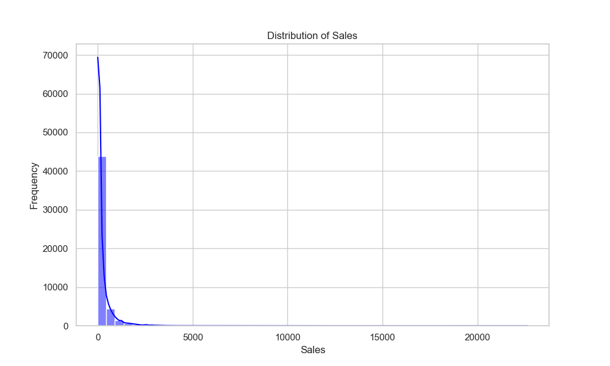
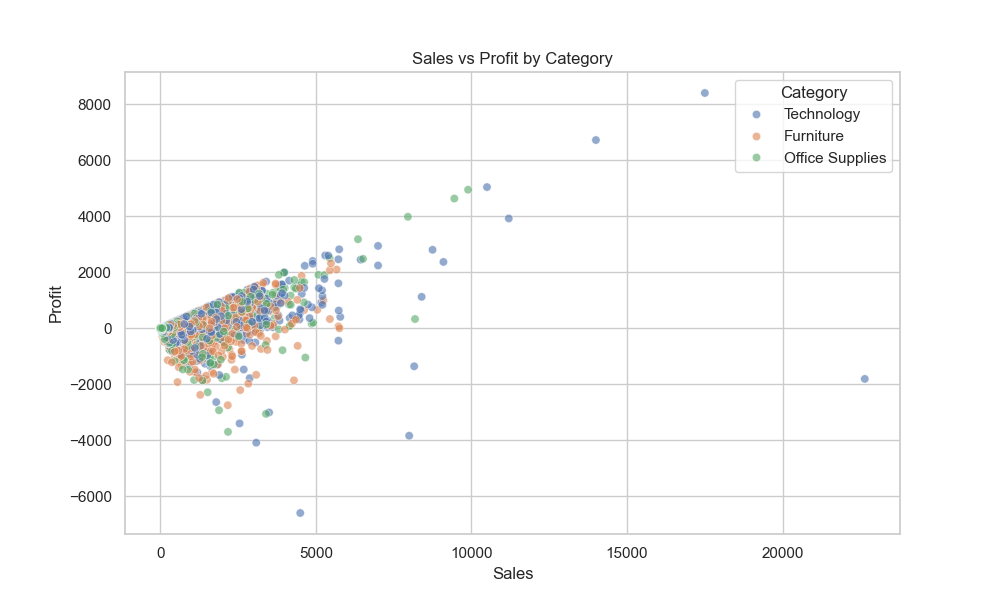
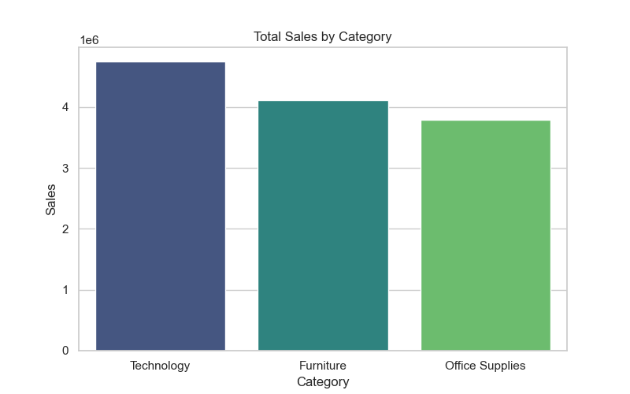
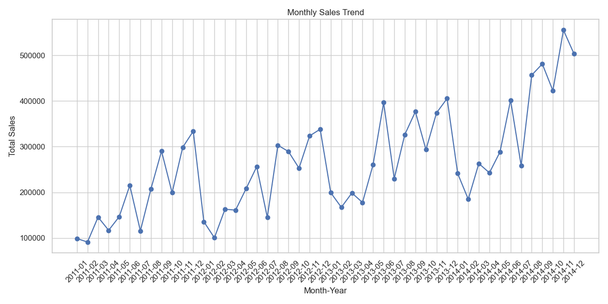
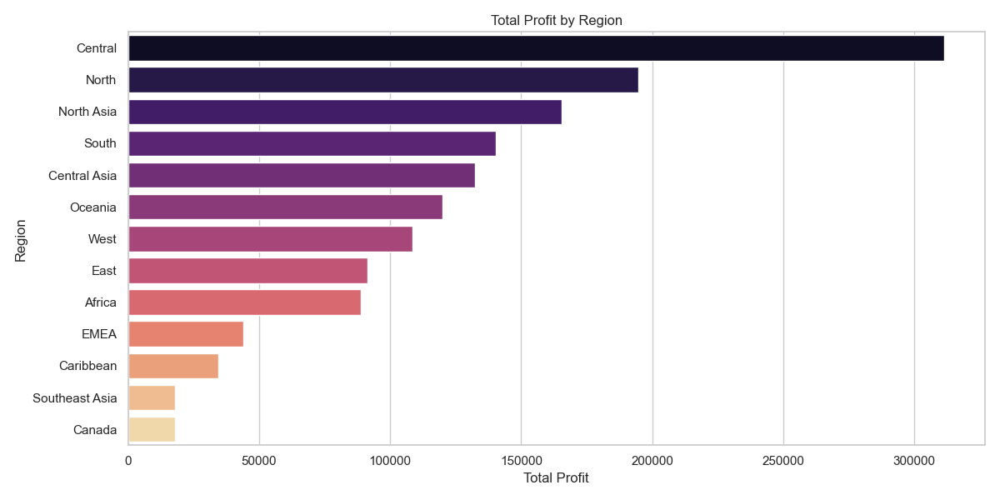
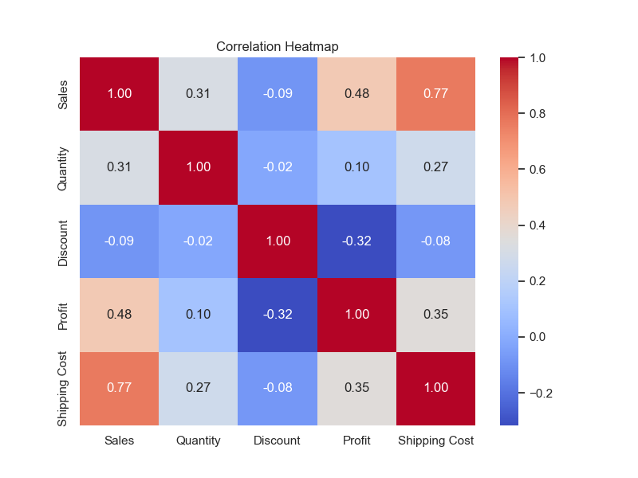

# Global Superstore Sales Analysis Report

## Data Overview
- **Total Records**: 51290
- **Total Sales**: $12,642,501.91
- **Total Profit**: $1,467,457.29

## Key Insights
1. **Sales Distribution**: The sales distribution is highly right-skewed, indicating most transactions are of low value, with a few high-value outliers.
2. **Sales vs Profit**: There is a positive correlation, but high sales do not always guarantee high profit, likely due to discounts.
3. **Top Category**: Technology generates the highest sales.
4. **Most Profitable Region**: Central is the most profitable region.
5. **Seasonality**: Monthly sales show trends and seasonality (refer to trend chart).

## Visualizations

